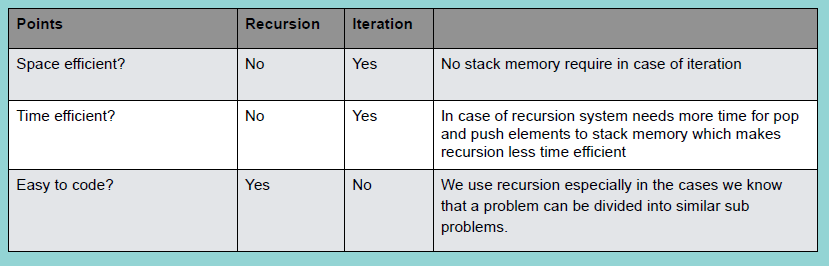

### Recursion

Problem solving using function calling itself

Recursion의 특성:
- same operation with different inputs
- 점점 더 작은 input 시도
- recursion을 멈추기 위한 base condition이 필요

두가지 조건:
1. 자기 자신을 호출하는 method
2. loop에서 벗어날 조건

 

재귀 함수가 자기 자신 호출할 때마다 stack 메모리에 저장 (그만큼 메모리 공간과 시간 사용)

 

Recursion으로 풀 수 있는 문제는 모두 iteration으로도 가능(복잡해질 수 있겠지만...)

problem이 더 작은 비슷한 problem으로 나뉠 수 있을 때 recursion 사용. (tree, graph에 유용)

 

 
 

### Recursion 작성

step 1: recursive case - the flow

step 2: base case - stopping criterion

step 3: unintentional case - the constraint