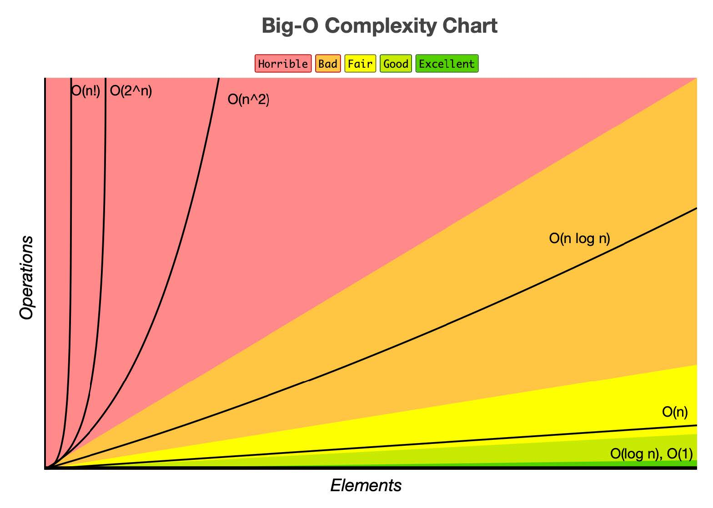

### Big O Notation

Time complexity: input의 사이즈에 따라 알고리즘의 runtime이 얼마나 증가하는가

알고리즘의 효율성을 나타내기 위해 Big O Notation 사용.

- Big O: 최악의 케이스, 즉 상한선 나타냄. 실제 runtime은 Big O 이하
- Big Ω: 최고의 케이스. 하한선
- Big Θ: 둘 사이

예를 들어, N개의 숫자의 배열에서 어느 특정 숫자의 위치를 찾으려 할때, 숫자 하나를 확인하는 데 1이라는 시간이 걸린다면...

- Big O -> O(N) (마지막에 위치할 경우)
- Big Ω -> Ω(1) (가장 처음에 위치할 경우)
- Big Θ -> Θ(N/2) (평균) 

 

### Time Complexity 계산

- O(1)
  - Constant time complexity
  - input과 상관없이 runtime 동일
  - ex) 배열의 특정 위치에 접근하는 경우
- O(N)
  - Linear time complexity
  - input 사이즈에 정비례하여 runtime 증가
  - ex) loop로 배열의 요소들 하나씩 접근
- O(LogN)
  - Logarithmic time complexity
  - 특정 요인에 의해 runtime 줄어듦
  - ex) for i range(0, len(array), 3)
  - ex) binary search
- O(N^2)
  - Quadratic time complexity
  - input 사이즈의 제곱에 비례하여 증가
  - ex) loop 안의 loop
- O(2^N)
  - Exponential time complexity
  - input 사이즈가 커질 때마다 두 배씩 증가
  - ex) 재귀를 두번 사용하여 표현한 피보나치

