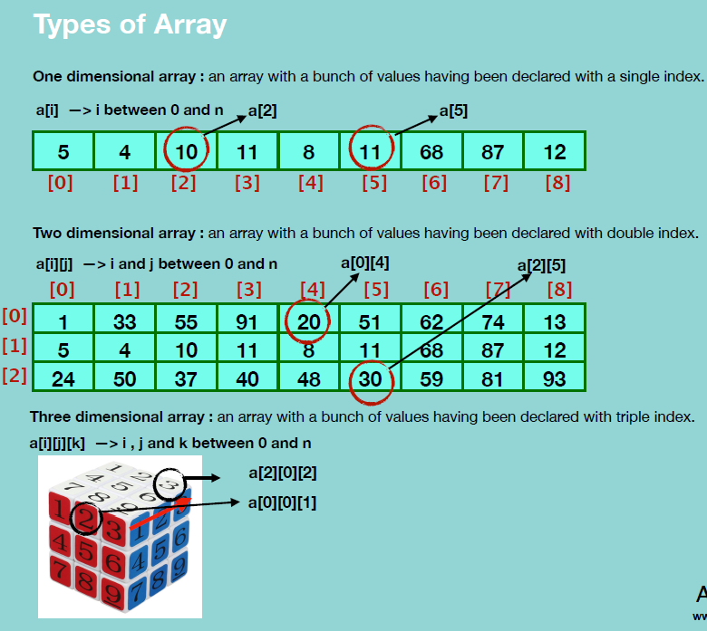

### Array

Array is a data structure consisting of collection of elements, each identified by at least one array index or key.

### Properties of Array

1. 하나의 array에는 동일한 데이터 타입만 저장
2. element들이 contiguous함. 사이에 빈 공간 없음
3. 각 element들은 unique한 index를 가짐.
4. array 사이즈가 정의되면 변경 불가

### Types of Array

- One Dimensional
- Multi Dimensional

