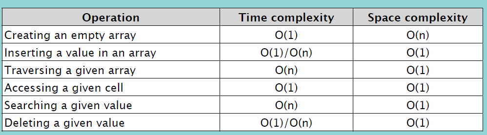

### Creating an Array

array 생성 시:
- 변수에 선언
- 자료형 정의
- 사이즈 정의

<br/>

파이썬에서는 일반적으로 list 사용.

array 사용을 위해서는 Array 모듈 사용

```python
from array import *

arrayName = array(typecode, [Initializers])
```
생성 시 time complexity: O(1)

<br/>

### Insertion

element 삽입 시 -> 자리 만들기 위해 다른 element들 자리 이동시킴

array 사이즈만큼 이미 꽉 차있다면? -> 더 큰 배열 만들어서 값들 복사

`array.insert(i, e)` i: 위치, e: 삽입할 요소

0 위치에 삽입 -> time complexity: O(n) (기존 element들을 하나씩 오른쪽으로 이동시켜야 하므로)

마지막 위치에 삽입 -> time complexity: O(1)

<br/>

### Traversal

```python
for i in array:
    print(i)
```
time complexity: O(n)

<br/>

### Accessing Element

index 사용

`array[i]` -> time complexity: O(1)

<br/>

### Searching Element

특정 element 위치를 찾기 위해서는 0번째부터 하나씩 확인

`array.index(e)` -> time complexity: O(n)

<br/>

### Deleting Element

element 삭제하고 나서 빈 자리가 없도록 왼 쪽으로 한 자리씩 이동

`array.remove(e)` -> 마지막 위치의 요소를 삭제하는 것이 아닌 이상, time complexity: O(n)

<br/>
<br/>

