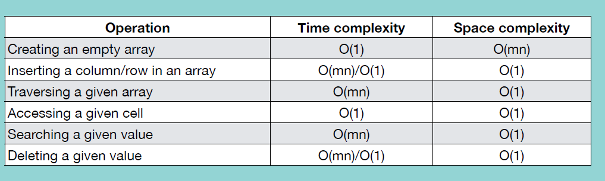

## Two Dimensional Array

행이 두 개 이상

numpy 사용

space complexity: O(MN)

<br/>

### Insertion

열 추가 시, 자리 만들기 위해 기존 열들 오른쪽으로 한 자리씩 이동

행 추가 시, 기존 행들 아래로 한 자리씩 이동

마지막 행/열에 추가하지 않는 이상 time complexity: O(MN)

`np.insert(array, 위치, values, axis=)`

axis 0: row 방향 / 1: col 방향

append 사용 -> 마지막 위치에 추가

`np.append(array, values, axis=)` time complextiy: O(1)

<br/>

### Accessing Element

`array[i][j]` -> i: row / j: col 

time complexity & space complexity: O(1)

`len(array)` -> row 갯수 반환. col 갯수 확인하고 싶으면 `len(array[0])`

<br/>

### Traversal

```python
for row in array:
    for value in row:
        print(value)
```

time complexity: O(MN) (행, 열 개수 동일하면 O(N^2))

<br/>

### Searching Element

```python
def searchTDArray(array, value):
    for i in range(len(array)):
        for j in range(len(array[0])):
            if array[i][j] == value:
                return str(i) + str(j)
    return "Not Found"
```

time complexity: O(MN) 혹은 O(N^2)

<br/>

### Deleting Element

삭제한 자리 채우기 위해 나머지 행/열 자리 이동

`np.delete(array, 위치, axis=)`

time complexity: O(MN) 혹은 O(N^2). 마지막 위치의 행/열 삭제하면 O(1)

space complexity: O(1)

<br/>

