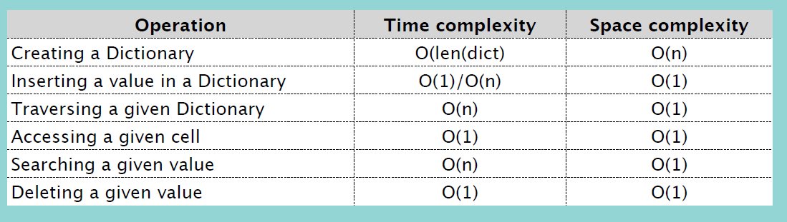
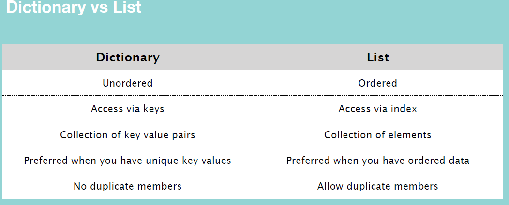

## Dictionary

key - value pairs.

unordered (index X) (3.6부터는 순서 기억)

<br/>

### Accessing Element(value)

`myDict['key']` -> time complexity: O(1)

<br/>

### Updating Element

`myDict['key'] = 'value'` -> time complexity: O(1)

<br/>

### Insertion

`myDict['newKey'] = 'value'` -> time complexity: O(1)

<br/>

### Traversal

```python
for key in myDict:
    print(key, myDict[key])
```

time complexity: O(n)

<br/>

### Searching Element (value)

linear search
```python
def searchDict(dict, value):
    for key in dict:
        if dict[key] == value:
            return key, value
    return '존재하지 않습니다'
```
time complexity: O(n)

<br/>

### Deletion

`myDict.pop('key')` 리스트의 pop은 인자를 안받아도 됐지만, 딕셔너리의 pop은 반드시 인자를 받아야 함. 반환 값은 인자로 받은 key의 value 값.

`myDict.popitem()` 마지막으로 추가한 key-value를 삭제하고, 튜플로 반환

`del myDict['key']`

`myDict.clear()` 모두 삭제

<br/>
<br/>



<br/>

### Dictionary VS List

