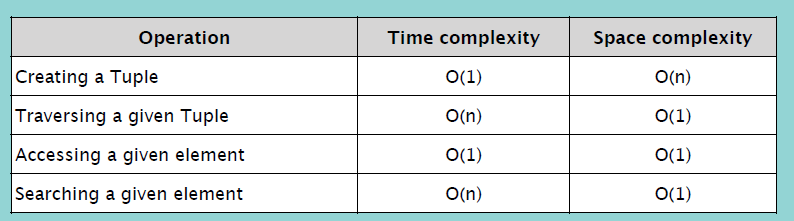

## Tuple

- 어느 자료형이든 저장 가능
- index (순서 존재)
- immutable. 선언 이후로 바꿀 수 없음.
- 'hashable'. immutable이기 때문에 튜플 객체를 hash 함수의 인자로 넣을 수 있음. 즉, hash값을 생성할 수 있음. 딕셔너리의 key로 튜플을 사용할 수 있는 이유.

<br/>

### 튜플 생성

```python
# element 1개:
myTuple = ('a',) # 콤마 필요

# element 2개 이상:
myTuple = 'a', 'b', 'c'
myTuple = ('a', 'b', 'c')

myTuple = tuple('abcde')
>>> ('a', 'b', 'c', 'd', 'e')
# string을 인자로 받으면 문자 하나하나를 element로 갖는 튜플 반환. list()도 마찬가지.
```

<br/>

### Accessing Element

`myTuple[i]`

### Traversal

```python
for i in myTuple:
    print(i)

for i in range(len(myTuple)):
    print(myTuple[i])
```
time complexity: O(n)

<br/>

### Searching Element

`e in myTuple` -> boolean.

<br/>

linear search
```python
searchTuple(myTuple, e):
    for i in myTuple:
        if i == e:
            return myTuple.index(i)
    return '존재하지 않습니다'
```
time complexity: O(n)

<br/>

### Deletion

특정 element만 삭제하는 것은 불가능.

`del myTuple` -> 모두 삭제

<br/>


