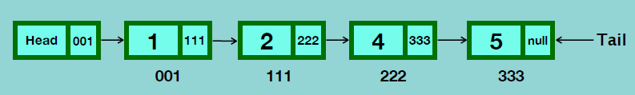
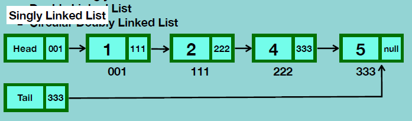
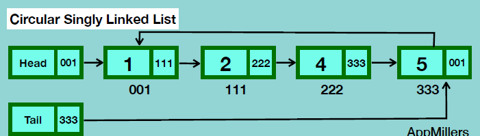
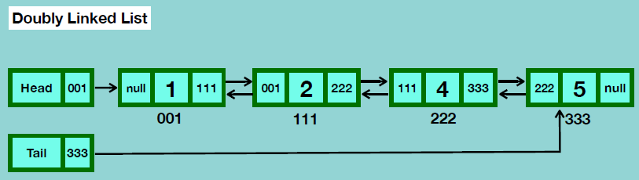
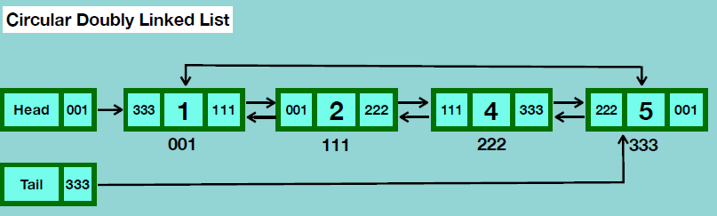

## Linked List

Linked List: 독립적인 node들로 이루어져 있고, 각 node는 data를 포함. node는 pointer로 다른 node를 참조하여, sequential한 collection을 이룸. (pointer로 참조하는 것이지, 실제 메모리에서 연달아 존재하지는 않음)

head 노드의 데이터 필드는 사용X. 첫번째 node를 참조하는 pointer만 갖고 있음. linked list의 시작을 알리는 역할.

마지막 node의 pointer는 null.

tail node의 데이터 필드도 사용X. linked list의 마지막을 알리는 역할

 

### Types of Linked List

- Singly Linked List
- Circular Singly Linked List
- Doubly Linked List
- Circular Doubly Linked List

 

### Singly Linked List

value와 pointer. 다음 node의 주소 참조.

단방향

### Circular Singly Linked List

마지막 node의 pointer가 null이 아니라 첫 node의 주소 참조

### Doubly Linked List

이전 node의 주소도 참조. 쌍방향

### Circular Doubly Linked List

첫번째 node와 마지막 node가 서로 참조