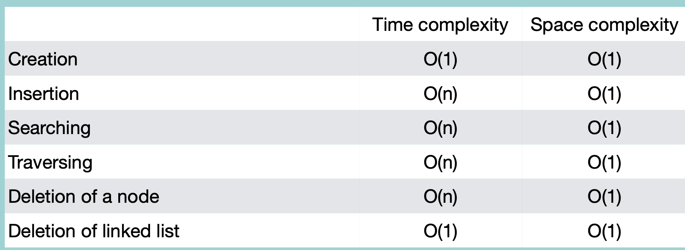

### Creation of Singly Linked List

1. head, tail 생성. pointer는 null
2. node 생성, 값 초기화, pointer는 null
3. head와 tail의 pointer를 위 node와 연결

<br/>

```python
class Node:
    def __init__(self, value = None):
        self.value = value # value
        self.next = None # 다음 node 참조

class SLinkedList:
    def __init__(self)
        self.head = None # head node
        self.tail = None # tail node

sLinkedList = SLinkedList() 
node1 = Node(1)
node2 = Node(2)

sLinkedList.head = node1 # head로 node1 지정
sLinkedList.head.next = node2 # node1 다음 node로 node2 지정
sLinkedList.tail = node2 # tail로 node2 지정
```

<br/>

### Insertion

```python
class Node:
    def __init__(self, value = None):
        self.value = value
        self.next = None # 다음 node 참조

class SLinkedList:
    def __init__(self):
        self.head = None
        self.tail = None

    def __iter__(self): # iterable하게 만들기
        node = self.head # head node부터 시작
        while node:
            yield node
            node = node.next # 다음 node로 이동
        
    # Insertion
    def insertNode(self, value, location):
        newNode = Node(value) # node 생성

        # 첫 node일 경우
        if self.head == None:
            self.head = newNode # head가 newNode 참조
            self.tail = newNode # tail이 newNode 참조

        # 이미 node가 존재할 경우
        else:
            # 0번째 위치에 삽입
            if location == 0:
                newNode.next = self.head # 포인터에 맨 앞 node 참조
                self.head = newNode # head가 newNode 참조
            # 마지막 위치에 삽입
            elif location == -1:
                newnode.next = None # 참조할 node 없음
                self.tail.next = newNode # 마지막 위치의 node가 newNode 참조
                self.tail = newNode # tail이 newNode 참조
            # 중간에 삽입
            else:
                # 삽입하고 싶은 위치의 바로 앞 node까지 하나하나 찾아가기
                tempNode = self.head
                index = 0
                while index < location - 1:
                    tempNode = tempNode.next # O(n)
                    index += 1
                nextNode = tempNode.next
                tempNode.next = newNode # 바로 앞 node가 newNode 참조
                newNode.next = nextNode # 바로 앞 node가 기존에 참조하던 node를 newNode가 대신 참조

                # 삽입하고 싶은 위치가 마지막일 경우
                if tempNode == self.tail:
                    self.tail = newNode # tail이 newNode 참조

sLinkedList = SLinkedList()
sLinkedList.insertNode(1, -1)
sLinkedList.insertNode(2, -1)
sLinkedList.insertNode(3, -1)
print([node.value for node in sLinkedList])
```

time complexity: O(n)

space complexityL O(1)

<br/>

### Traversal

```python
class SLinkedList:
    #
    #
    def traverseNode(self):
        if self.head == None:
            print("존재하지 않습니다")
        else:
            node = self.head
            while node != None:
                print(node.value)
                node = node.next
```

time complexity: O(n)

<br/>

### Searching node

```python
class SlinkedList:
    #
    #
    def searchNode(self, value):
        if self.head == None:
            return "리스트가 존재하지 않습니다"
        else:
            node = self.head
            while node != None:
                if node.value == value:
                    return node.value
                node.next
            return "존재하지 않습니다"
```

time complexity: O(n)

<br/>

## Deletion

```python
class SlinkedList:
    #
    #
    def deleteNode(self, location):
        if self.head == None:
            print("리스트가 존재하지 않습니다.")
        else:
            # 0번째 위치 삭제
            if location == 0:
                # 기존 node가 하나일 경우:
                if self.head = self.tail:
                    self.head = None
                    self.tail = None
                # 기존 node가 두 개 이상일 경우:
                else:
                    self.head = self.head.next # head가 기존 node의 다음 node 참조
            # 마지막 위치 삭제
            elif location == -1:
                # 기존 node가 하나일 경우:
                if self.head == self.tail:
                    self.head = None
                    self.tail = None
                # 기존 node가 두 개 이상일 경우:
                else:
                    # 마지막에서 두번째 node까지 이동
                    tempNode = self.head
                    while tempNode.next != self.tail:
                        tempNode = tempNode.next
                    tempNode.next = None # 마지막 node 연결 끊기
                    self.tail = tempNode # tail을 남아있는 node에 연결
            # 중간 위치 삭제
            else:
                # 삭제할 node의 바로 앞 node까지 이동
                tempNode = self.head
                index = 0
                while index < location -1:
                    tempNode = tempNode.next
                    index += 1
                nextNode = tempNode.next
                tempNode.next = nextNode.next # 삭제할 node의 앞 node와 뒤 node를 연결
```

time complexity: O(n)

<br/>

### Delete Entire List

SLinkedList 객체가 변수로 참조하고 있는 head의 연결만 끊으면 garbage collector가 tail을 제외한 나머지 node들 삭제.

```python
class SLinkedList:
    #
    #
    def deleteAll(self):
        if self.head == None:
            print("리스트가 존재하지 않습니다")
        else:
            self.head = None
            self.tail = None
```

time complexity: O(1)

<br/>
<br/>

