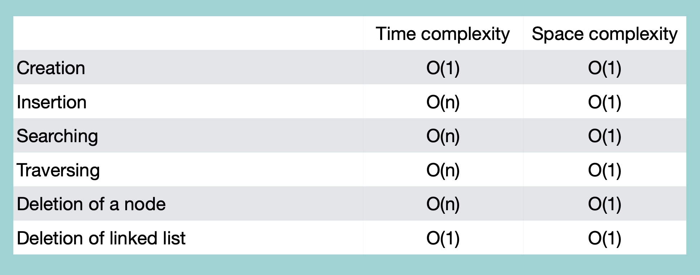

### Creation

```python
class Node:
    def __init__(self, value=None):
        self.value = value
        self.next = None

class CSLinkedList:
    def __init__(self):
        self.head = None
        self.tail = None

    def __iter__(self):
        node = self.head
        while node:
            yield node
            if node.next == self.head: # 다음 node가 첫번째 node일 경우
                break
            else:
                node = node.next

    def createCSLinkedList(self, value):
        node = Node(value)
        node.next = node # node가 하나 뿐이므로, 다음 node로 자기 자신 참조
        self.head = node
        self.tail = node
```
time complexity: O(1)

<br/>

### Insertion

```python
class CSLinkedList:
    #
    #
    def insertCSLL(self, value, location):
        if self.head == None:
            "존재하지 않습니다"
        else:
            newNode = Node(value)
            # 첫 번째 위치에 삽입
            if location == 0:
                newNode.next = self.head
                self.head = newNode
                self.tail.next = newNode # SLinkedList와 동일하지만, 마지막 node가 newNode 참조
            # 마지막 위치에 삽입
            elif location == -1:
                newNode.next = self.head # 마지막 위치에 넣은 newNode가 첫번째 node 참조
                self.tail.next = newNode
                self.tail = newNode
            # 중간에 삽입
            else:
                tempNode = self.head
                index = 0
                while index < location - 1:
                    tempNode = tempNode.next
                    index += 1
                nextNode = tempNode.next
                tempNodenext = newNode
                newNode.next = nextNode
```
time complexity: O(n)

<br/>

### Traversal

```python
class CSLinkedList:
    #
    #
    def traverseCSLL(self):
        if self.head == None:
            print("리스트가 존재하지 않습니다")
        else:
            tempNode = self.head
            while tempNode:
                print(tempNode.value)
                tempNode = tempNode.next
                if tempNode == self.head: # 첫번째 node로 돌아오면 중단
                    break
```
time complexity: O(n)

<br/>

### Searching Node

```python
class CSLinkedList:
    #
    #
    def searchCSLL(self, value):
        if self.head == None:
            print("리스트가 존재하지 않습니다")
        else:
            tempNode = self.head
            while tempNode:
                if tempNode.value == value:
                    return tempNode.value
                tempNode = tempNode.next
                # 마지막 node까지 확인했을 경우
                if tempNode == self.head:
                    return "node가 존재하지 않습니다."
```
time complexity: O(n)

<br/>

### Deletion

```python
class CSLinkedList:
    #
    #
    def deleteNode(self, location):
        if self.head == None:
            print("리스트가 존재하지 않습니다")
        else:
            # 첫번째 위치 삭제
            if location == 0:
                # node가 하나인 경우:
                if self.head == self.tail:
                    self.head = None
                    self.tail.next = None
                    self.tail = None
                # 두 개 이상인 경우:
                else:
                    self.head = self.head.next
                    self.tail.next = self.head # 마지막 node와 맨 앞 node 연결
            # 마지막 위치 삭제
            elif location == -1:
                # node가 하나인 경우:
                if self.head == self.tail:
                    self.head = None
                    self.tail.next = None
                    self.tail = None
                # 두 개 이상인 경우:
                else:
                    node = self.head
                    while node:
                        # 마지막에서 두번째 위치까지 이동
                        if node.next == self.tail:
                            break
                        node = node.next
                    node.next = self.head # 해당 node를 맨 앞 node와 연결
                    self.tail = node
            # 중간 위치 삭제
            else:
                tempNode = self.head
                index = 0
                while index < location - 1:
                    tempNode = tempNode.next
                    index += 1
                nextNode = tempNode.next
                tempNode.next = nextNode.next
```
time complexity: O(n)

<br/>

### Delete Entire List

```python
class CSLinkedList:
    #
    #
    def deleteAll(self):
        self.head = None
        self.tail.next = None
        self.tail = None
```
time compexityL O(1)

<br/>
<br/>

