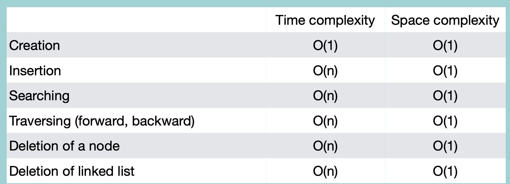

### Creation

```python
class Node:
    def __init__(self, value=None):
        self.value = value
        self.next = None
        self.prev = None # 양방향이므로 이전 node도 참조

class DLinkedList:
    def __init__(self):
        self.head = None
        self.tail = None
    
    def __iter__(self):
        node = self.head
        while node:
            yield node
            node = node.next

    def createDLL(value):
        node = Node(value)
        node.prev = None
        node.next = None
        self.head = node
        self.tail = node
```
time complexity: O(1)

<br/>

### Insertion

```python
class DLinkedList:
    #
    #
    def insertNode(self, value, location):
        if self.head == None:
            return "리스트가 존재하지 않습니다."
        else:
            newNode = Node(value)
            # 첫번째 위치에 삽입
            if location == 0:
                newNode.prev = None 
                newNode.next = self.head
                self.head.prev = newNode # 기존 첫번째 node의 앞에 위치
                self.head = newNode # newNode가 첫번째
            # 마지막 위치에 삽입
            elif location == -1:
                newNode.prev = self.tail
                newNode.next = None
                self.tail.next = newNode
                self.tail = newNode
            # 중간에 삽입
            else:
                tempNode = self.head
                index = 0
                while index < location - 1:
                    tempNode = tempNode.next
                    index += 1
                nextNode = tempNode.next
                newNode.prev = tempNode
                newNode.next = nextNode
                tempNode.next = newNode
                nextNode.prev = newNode  
```
time complexity: O(n)

<br/>

### Traversal

```python
class DLinkedList:
    #
    #
    def traverseDLL(self):
        if self.head == None:
            return "리스트가 존재하지 않습니다."
        else:
            node = self.head
            while node:
                print(node,value)
                node = node.next
```
time complexity: O(n)

### Reverse Traversal

```python
class DLinkedList:
    #
    #
    def reverseTraverseDLL(self):
        if self.head == None:
            return "리스트가 존재하지 않습니다."
        else:
            node = self.tail
            while node:
                print(node.value)
                node = node.prev
```
time complexity: O(n)

<br/>

### Searching Node

```python
class DLinkedList:
    #
    #
    def searchNode(self, value):
        if self.head == None:
            return "리스트가 존재하지 않습니다."
        else:
            node = self.head
            while node:
                if node.value == value:
                    return node.value
                node = node.next
            return "node가 존재하지 않습니다."
```
time complexity: O(n)

<br/>

### Deletion

```python
class DLinkedList:
    #
    #
    def deleteNode(self, location):
        if self.head == None:
            return "리스트가 존재하지 않습니다."
        else:
            # 첫번째 위치 삭제
            if location == 1:
                # node가 하나일 경우:
                if self.head == self.tail:
                    self.head = None
                    self.tail = None
                # node가 두 개 이상일 경우:
                else:
                    self.head = self.head.next # 그 다음 node로 head 지정
                    self.head.prev = None # 기존 node와 연결 끊기
            # 마지막 위치 삭제
            elif location == -1:
                # node가 하나일 경우:
                if self.head == self.tail:
                    self.head = None
                    self.tail = None
                # node가 두 개 이상일 경우:
                else:
                    self.tail = self.tail.prev # 마지막 node의 앞 node를 tail로 지정
                    self.tail.next = None # 기존 node와 연결 끊기
            # 중간 위치 삭제
            else:
                tempNode = self.head
                index = 0
                while index < location - 1:
                    tempNode = tempNode.next
                    index += 1
                tempNode.next = tempNode.next.next
                tempNode.next.prev = tempNode
```
time complexity: O(n)

<br/>

### Deleting Entire List

head와 tail을 null로 바꿔도, 각 node들은 누군가에 의해 참조되기 때문에, 사라지지 않음.

따라서 양방향 연결을 단방향으로 바꾼 후, head와 tail을 null로 바꾸기

```python
class DLinkedList:
    #
    #
    def deleteAll(self):
        if self.head == None:
            return "리스트가 존재하지 않습니다."
        else:
            node = self.head
            while node:
                node.prev = None # 양방향 연결 끊기
                node = node.next
            self.head = None
            self.tail = None
```
time complexity: O(n)

<br/>
<br/>

