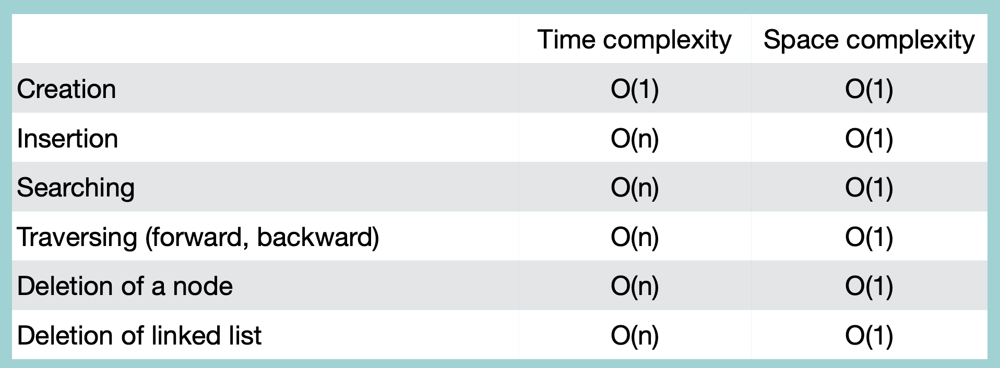

### Creation

node 1개의 경우, 자기자신을 참조

```python
class Node:
    def __init__(self, value=None):
        self.value = value
        self.next = None
        self.prev = None

class CDLinkedList:
    def __init__(self):
        self.head = None
        self.tail = None
    
    def __iter__(self):
        node = self.head
        while node:
            yield node
            node = node.next
            if node == self.head:
                break

    def createCCDLL(self, value):
        newNode = Node(value)
        self.head = newNode
        self.tail = newNode
        newNode.next = newNode # 앞뒤로 자기 자신 참조
        newNode.prev = newNode
```
time complexity: O(1)

<br/>

### Insertion

```python
class CDLinkedList:
    #
    #
    def insertNode(self, value, location):
        if self.head == None:
            return "리스트가 존재하지 않습니다."
        else:
            newNode = Node(value)
            # 첫번째 위치에 삽입
            if location == 0:
                newNode.next = self.head
                newNode.prev = self.tail
                self.head.prev = newNode
                self.tail.next = newNode
                self.head = newNode
            # 마지막 위치에 삽입
            elif location == -1:
                newNode.next = self.head
                newNodeprev = self.tail
                self.head.prev = newNode
                self.tail.next = newNode
                self.tail = newNode
            # 중간에 삽입
            else:
                tempNode = self.head
                index = 0
                while index < location - 1:
                    tempNode = tempNode.next
                    index += 1
                nextNode = tempNode.next
                newNode.next = nextNode
                newNode.prev = tempNode
                tempNode.next = newNode
                nextNode.prev = newNode
```
time complexity: O(n)

<br/>

### Traversal

```python
class CDLinkedList:
    #
    #
    def traverseCDLL(self):
        if self.head == None:
            return "리스트가 존재하지 않습니다."
        else:
            tempNode = self.head
            while tempNode:
                print(tempNode.value)
                if tempNode == self.tail:
                    break
                tempNode = tempNode.next
```
time complexity: O(n)

### Reverse Traversal

```python
class CDLinkedList:
    #
    #
    def reverseTraverseCDLL(self):
        if self.head == None:
            return "리스트가 존재하지 않습니다."
        else:
            tempNode = self.tail
            while tempNode:
                print(tempNode.value)
                if tempNode == self.head:
                    break
                tempNode = tempNode.prev
```
time complexity: O(n)

<br/>

### Searching Node

```python
class CDLinkedList:
    #
    #
    def searchNode(self, value):
        if self.head == None:
            return "리스트가 존재하지 않습니다."
        else:
            node = self.head
            while node:
                if node.value == value:
                    return node.value
                if node == self.tail:
                    return "node가 존재하지 않습니다"
                node = node.next
```
time complexity: O(n)

<br/>

### Deletion

```python
class CDLinkedList:
    #
    #
    def deleteNode(self, location):
        if self.head == None:
            return "리스트가 존재하지 않습니다."
        else:
            # 첫 번째 위치 삭제
            if location == 0:
                # node가 하나일 경우
                if self.head == self.tail:
                    self.head.prev = None
                    self.head.next = None
                    self.head = None
                    self.tail = None
                # node가 여러개일 경우
                else:
                    self.head = self.head.next
                    self.head.prev = self.tail
                    self.tail.next = self.head
            # 마지막 위치 삭제
            elif location == -1:
                # node가 하나일 경우
                if self.head == self.tail:
                    self.head.prev = None
                    self.head.next = None
                    self.head = None
                    self.tail = None
                # node가 여러개일 경우
                else:
                    self.tail = self.tail.prev
                    self.tail.next = self.head
                    self.head.prev = self.tail
            # 중간 위치 삭제
            else:
                tempNode = self.head
                index = 0
                while index < location - 1:
                    tempNode = tempNode.next
                    index += 1
                nextNode = tempNode.next.next
                tempNode.next = nextNode
                nextNode.prev = tempNode
```
time complexity: O(n)

<br/>

### Deleting Entire List

마지막 node -> 첫번째 node 참조를 끊고, 양방향 연결을 단방향으로 바꾼후, head와 tail을 null로 변경

```python
class CDLinkedList:
    #
    #
    def deleteAll(self):
        if self.head == None:
            return "리스트가 존재하지 않습니다."
        else:
            self.tail.next = None
            tempNode = self.head
            while tempNode:
                tempNode.prev = None
                tempNode = tempNode.next
            self.head = None
            self.tail = None
```
time complexity: O(n)

<br/>
<br/>

