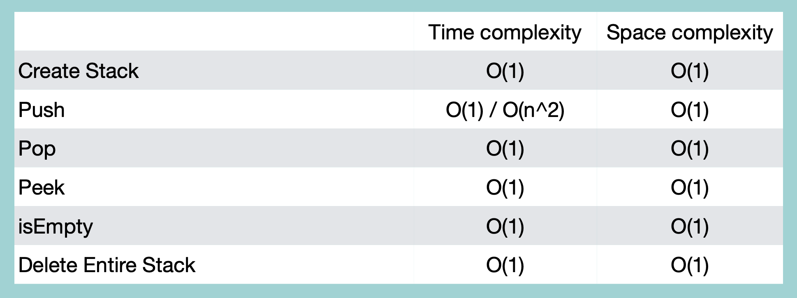

## Stack with List

- 정해진 사이즈 X
- 구현이 쉬움
- 사이즈가 커질수록 속도 문제 발생

<br/>

### Creation

```python
class Stack:
    def __init__(self):
        self.list = []

    def __str__(self):
        values = self.list.reverse() 
        values = [str(e) for e in self.list]
        return '\n'.join(values)
```
time complexity: O(1)

<br/>

### isEmpty

```python
class Stack:
    #
    #
    def isEmpty(self):
        if self.list == []:
            return True
        else:
            return False
```

<br/>

### Push

```python
class Stack:
    #
    #
    def push(self, value):
        self.list.append(value)
```

<br/>

### Pop

```python
class Stack:
    #
    #
    def pop(self):
        if self.isEmpty():
            return "빈 스택입니다"
        else:
            return self.list.pop()
```

<br/>

### Peek

```python
class Stack:
    #
    #
    def peek(self):
        if self.isEmpty():
            return "빈 스택입니다"
        else:
            return self.list[-1]
```

<br/>

### Deletion

```python
class Stack:
    #
    #
    def delete(self):
        self.list = None
```

<br/>
<br/>

