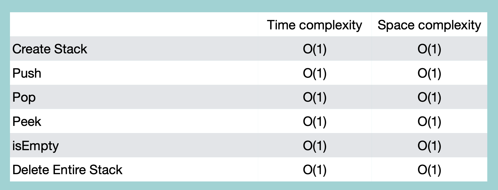

## Stack with Linked List

- 정해진 사이즈 X
- 속도 장점
- 구현 복잡

가장 마지막에 추가된 element가 head. (tail 아님)

<br/>

### Creation

```python
class Node:
    def __init__(self, value = None):
        self.value = value
        self.next = next

class LinkedList:
    def __init__(self):
        self.head = None

    def __iter__(self):
        node = self.head
        while node:
            yield node
            node = node.next

class Stack:
    def __init__(self):
        self.linkedList = LinkedList()

    def __str__(self):
        values = [str(node.value) for node in self.linkedList]
        return '\n'.joind(values)
```

<br/>

### isEmpty

```python
class Stack:
    #
    #
    def isEmpty(self):
        if self.linkedList.head == None:
            return True
        else:
            return False
```

<br/>

### Push

```python
class Stack:
    #
    #
    def push(self, value):
        node = Node(value)
        node.next = self.linkedList.head
        self.linkedList.head = node
```

<br/>

### Pop

```python
class Stack:
    #
    #
    def pop(self):
        if self.isEmpty():
            return "빈 스택입니다"
        else:
            value = self.linkedList.head.value
            self.linkedList.head = self.linkedList.head.next
            return value
```

<br/>

### Peek

```python
class Stack:
    #
    #
    def peek(self):
        if self.isEmpty():
            return '빈 스택입니다'
        else:
            value = self.linkedList.head.value
            return value
```

<br/>

### Deletion

```python
class Stack:
    #
    #
    def delete(self):
        self.linkedList.head = None
```

<br/>
<br/>

