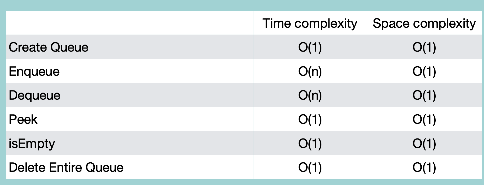

## Queue with List

### Creation

```python
class Queue:
    def __init__(self):
        self.items = []

    def __str__(self):
        values = [str(e) for e in self.items]
        return ' '.join(values)
```

<br/>

### isEmpty

```python
class Queue:
    #
    #
    def isEmpty(self):
        if self.items == []:
            return True
        else:
            return False
```

<br/>

### Enqueue

```python
class Queue:
    #
    #
    def enqueue(self, value):
        self.items.append(value)
```

<br/>

### Dequeue

```python
class Queue:
    #
    #
    def dequeue(self):
        if self.isEmpty():
            return "빈 큐입니다"
        else:
            return self.items.pop(0)
```
time complexity: 리스트에서 하나 삭제하면, 나머지를 한 자리씩 이동하여 빈 자리 채움. 따라서 O(n)

<br/>

### Peek

```python
class Queue:
    #
    #
    def peek(self):
        if self.isEmpty():
            return "빈 큐입니다"
        else:
            return self.items[0]
```

<br/>

### Deletion

```python
class Queue:
    #
    #
    def delete(self):
        self.items = None
```

<br/>
<br/>

