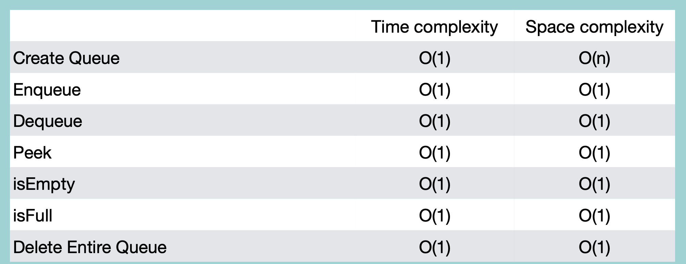

### Queue with fixed Size (Circular Queue)

사이즈가 고정된 queue의 경우...

1. 첫 생성 -> 모든 메모리의 값을 None으로 초기화 & Start, Top 포인터를 -1로 초기화
2. 첫 element 저장 시, Start, Top 포인터 0
3. enqueue하면서 Top포인터 값 증가
4. dequeue하면서 Start포인터 값 증가
5. 다시 enqueue 시, 빈 자리에 값 저장 & Top 포인터 0으로 이동

<br/>

### Creation

```python
class Queue:
    def __init__(self, maxSize):
        self.items = [None] * maxSize # 최대 사이즈만큼 None 생성
        self.maxSize = maxSize
        self.start = -1 # start & top pointer
        self.top = -1

    def __str__(self):
        values = [str(e) for e in self.items]
        return ' '.join(values)
```
time complexity: O(1)

space complexity: O(n)

<br/>

### isFull

```python
class Queue:
    #
    #
    def isFull(self):
        # start포인터가 0, top포인터가 마지막 위치인 경우
        if self.start == 0 & self.top + 1 == self.maxSize:
            return True
        # top포인터가 start포인터 바로 앞에 위치한 경우
        elif self.start == self.top + 1:
            return True
        # 빈 공간이 있는 경우
        else:
            return False
```
time complexity: O(1)

<br/>

### isEmpty

```python
class Queue:
    #
    #
    def isEmpty(self):
        if self.top == -1:
            return True
        else:
            return False
```

<br/>

### Enqueue

```python
class Queue:
    #
    #
    def enqueue(self, value):
        if self.isFull():
            return "큐가 다 찼습니다"
        else:
            # top포인터가 마지막 위치인 경우 -> 0부터 다시 시작
            if self.top + 1 == self.maxSize:
                self.top = 0
            else:
                self.top += 1
                # 처음 추가하는 경우
                if self.start == -1:
                    self.start = 0
            # top포인터의 위치에 값 저장
            self.items[self.top] = value
```

<br/>

### Dequeue

```python
class Queue:
    #
    #
    def dequeue(self):
        if self.isEmpty():
            return "빈 큐입니다"
        else:
            value = self.items[self.start] # start위치 반환
            start = self.start
            # element가 하나인 경우
            if self.start == self.top:
                self.start = -1
                self.top = -1
            # start포인터 위치가 마지막인 경우
            elif self.start + 1 == self.maxsize:
                self.start = 0
            # start포인터의 위치가 마지막이 아닌 경우
            else:
                self.start += 1
            self.items[start] = None # 값 삭제
            return value
```

<br/>

### Peek

```python
class Queue:
    #
    #
    def peek(self):
        if self.isEmpty(self):
            return "빈 큐입니다"
        else:
            return self.itemsp[self.start]
```

<br/>

### Deletion

```python
class Queue:
    #
    #
    def delete(self):
        self.items = [None] * self.maxSize
        self.top = -1
        self.start = -1
```

<br/>
<br/>

