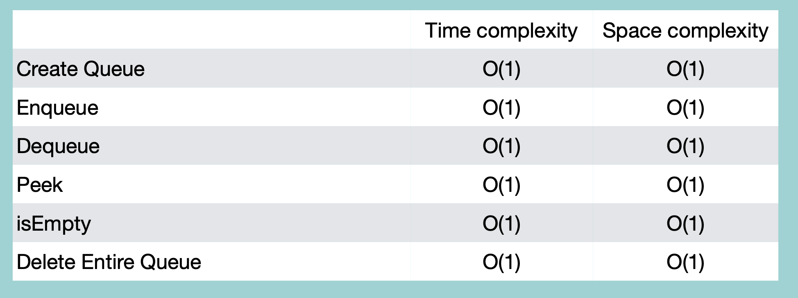

## Queue with Linked List

### Creation

```python
class Node:
    def __init__(self, value=None):
        self.value = value
        self.next = None

    def __str__(self):
        return str(self.value)

class LinkedList:
    def __init__(self):
        self.head = None
        self.tail = None

    def __iter__(self):
        node = self.head
        while node:
            yield node
            node = node.next

class Queue:
    def __init__(self):
        self.linkedList = LinkedList()

    def __str__(self):
        values = [str(e) for e in self.linkedlist]
        return ' '.join(values)
```

<br/>

### Enqueue

```python
class Queue:
    #
    #
    def enqueue(self, value):
        node = Node(value)
        # 기존 node가 없는 경우
        if self.linkedList.head == None:
            self.linkedList.head = node
            self.linkedList.tail = node
        # 기존 node가 있는 경우
        else:
            self.linkedList.tail.next = node
            self.linkedList.tail = node
```

<br/>

### isEmpty

```python
class Queue:
    #
    #
    def isEmpty(self):
        if self.linkedList.head == None:
            return True
        else:
            return False
```

<br/>

### Dequeue

```python
class Queue:
    #
    #
    def dequeue(self):
        if self.isEmpty():
            return "빈 큐입니다"
        else:
            node = self.linkedList.head
            # node가 하나 뿐일 경우
            if self.linkedList.head == self.linkedList.tail:
                self.linkedList.head = None
                self.linkedList.tail = None
            # node가 두개 이상일 경우
            else:
                self.linkedList.head = self.linkedList.head.next
            return node
```

<br/>

### Peek

```python
class Queue:
    #
    #
    def peek(self):
        if self.isEmpty(self):
            return "빈 큐입니다"
        else:
            return self.linkedList.head
```

<br/>

### Deletion

```python
class Queue:
    #
    #
    def delete(self):
        self.linkedList.head = None
        self.linkedList.tail = None
```

<br/>
<br/>

