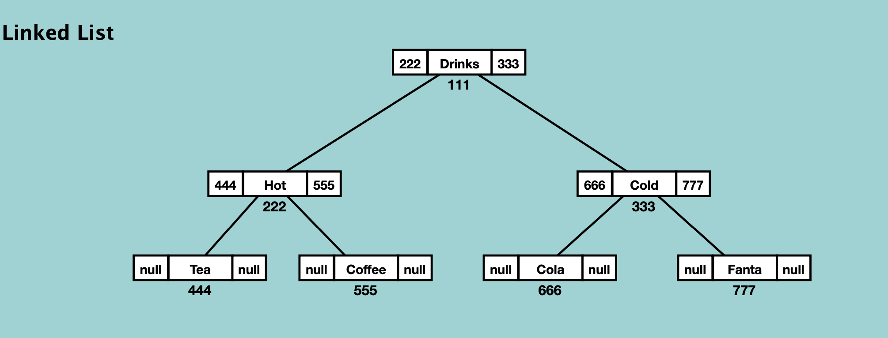
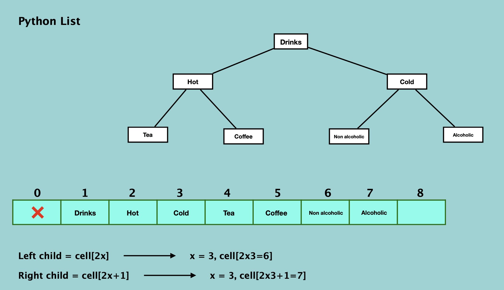

## Binary Tree

최대 자식 수: 2 (left & right)

Binary Tree
- Binary Search Tree
- Heap Tree
- AVL Tree
- Red Black Tree
- Syntax Tree

 

Full Binary Tree: 모든 node가 2개 혹은 0개의 자식을 가짐. 

Perfect Binary Tree: 모든 node가 2개의 자식을 가짐 (모든 leaf가 같은 레벨에 존재)

Complete Binary Tree: 마지막 level을 제외한 나머지 level의 node들이 가득 차있고, 마지막 level에서는 가장 왼쪽부터 채워지는 형태

Balanced Binary Tree: 모든 leaf가 같은 level

 
 

Binary Tree with Linked List

Binary Tree with Python List

