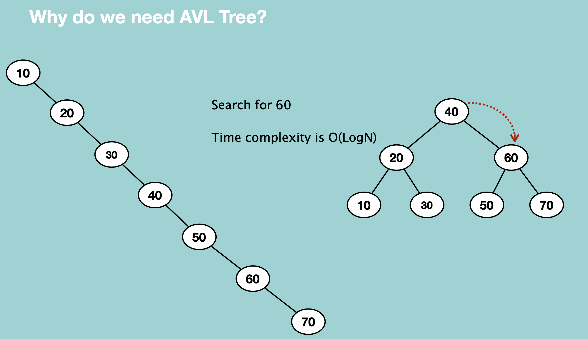

## AVL Tree

Binary Search Tree의 종류. left & right subtree의 height 차이가 1 이하

Binary Search Tree는 searching이 빠르다는 것이 장점인데(O(logn)), tree를 만들 때 재수없으면 O(n)이 되어버림. 예를 들어, 값이 추가되는 순서가 1, 2, 3, 4, 5 일 경우, 모두 right child만 있고, left child는 없게 됨.

