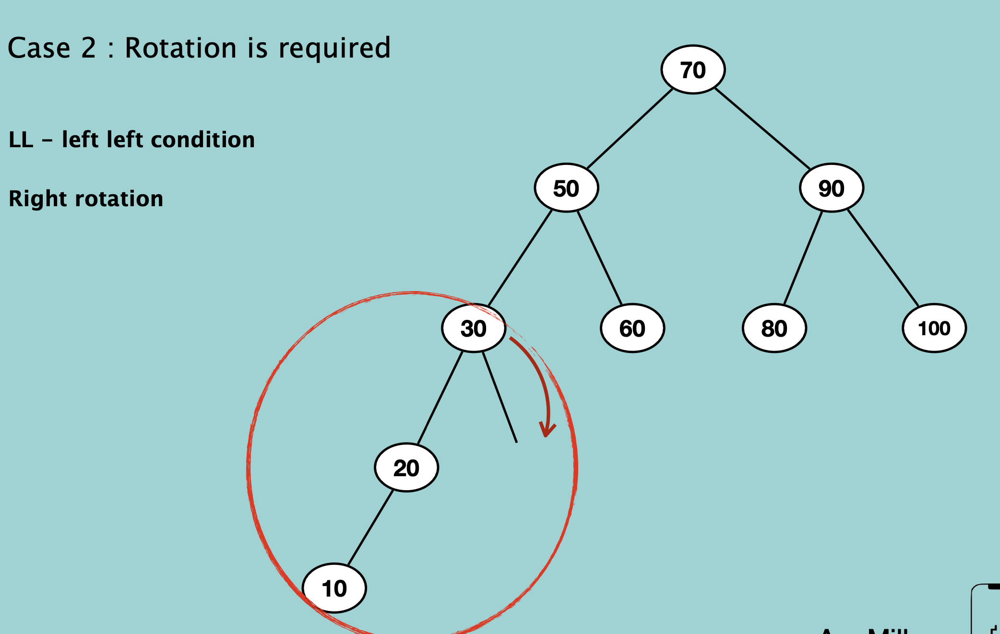
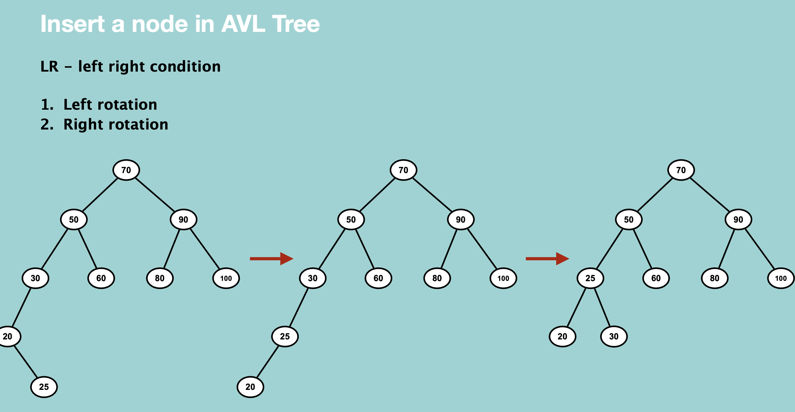
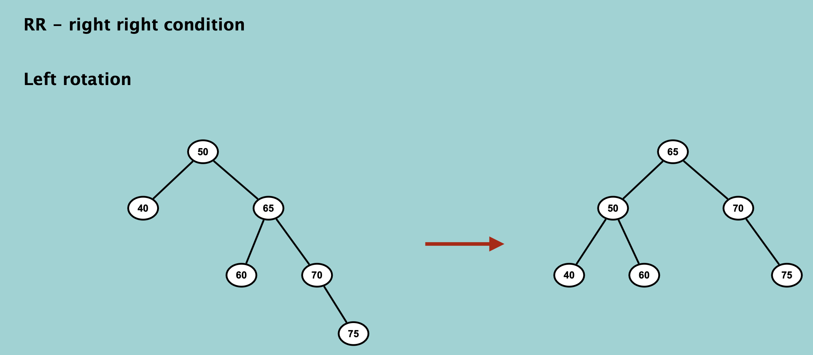

### Creation

```python
class AVLNode:
    def __init__(self, value):
        self.value = value
        self.leftChild = None
        self.rightChild = None
        self.height = 1

newAVL = AVLNode(10)
```

<br/>

### Traversal

```python
def preOrderTraversal(rootNode):
    if not rootNode:
        return
    print(rootNode.value)
    preOrderTraversal(rootNode.leftChild)
    preOrderTraversal(rootNode.rightChild)

def inOrderTraversal(rootNode):
    if not rootNode:
        return
    inOrderTraversal(rootNode.leftChild)
    print(rootNode.value)
    inOrderTraversal(rootNode.rightChild)

def postOrderTraversal(rootNode):
    if not rootNode:
        return
    postOrderTraversal(rootNode.leftChild)
    postOrderTraversal(rootNode.rightChild)
    print(rootNode.value)

def levelOrderTraversal(rootNode):
    if not rootNode:
        return
    else:
        customQueue = Queue()
        customQueue.enqueue(rooteNode)
        while not(customeQueue.isEmpty()):
            root = customQueue.dequeue()
            print(root.value.value)
            if root.value.leftChild != None:
                customQueue.enqueue(root.value.leftChild)
            if root.value.rightChild != None:
                customQueue.enqueue(root.value.rightChild)
```

<br/>

### Search

```python
def searchNode(rootNode, value):
    if rootNode.value == value:
        print("발견")
    elif value < rootNode.value:
        searchNode(rootNode.leftChild, value)
    else:
        searchNode(rootNode.rightChild, value)
```

<br/>

### Insertion








```python

``` 