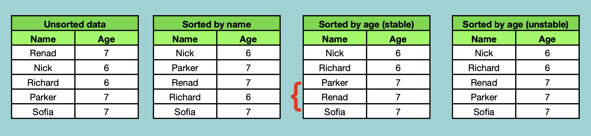

## Sorting

데이터를 오름차순/내림차순 정렬

### Types
- Space Used
    - In Place
    - Out Place
- Stability
    - Stable
    - Unstable

 

In Place: 정렬을 위해 extra space가 필요하지 않음

Out Place: extra space 필요

Stable: 동일한 값의 데이터가 두개 이상 있을 경우, 정렬을 해도 그 순서를 유지

Unstable: 순서 유지 X

 

### Terminolopy

Increasing Order: successive element is greater than prev

Decreasing Order: successive element is smaller than prev

Non Increasing Order (비오름차순): successive element is smaller than or equal to prev (11, 9, 7, 5, 5, 3, 1)

Non Decreasing Order (비내림차순): successive element is greater than or equal to prev (1, 3, 5, 7, 7, 9, 11)